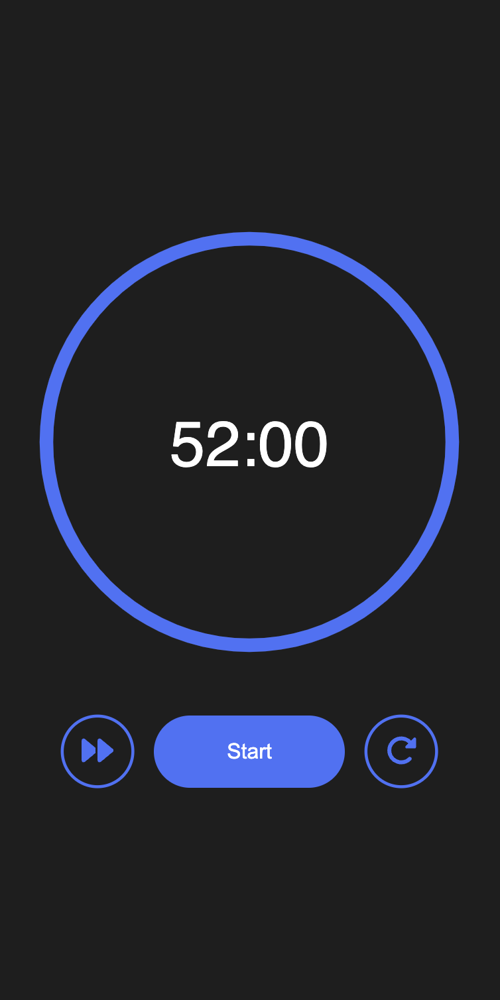

# Pomodoro Timer
A simple Pomodoro timer with a great view in the mobile client (currently only supporting small-sized screens).

p.s. some of the setting options have not been completely implemented.

<table>
    <tr>
        <td></td>
        <td></td>
        <td></td>
    </tr>
    <tr>
        <td></td>
        <td></td>
        <td>
</td>
    </tr>
</table>
